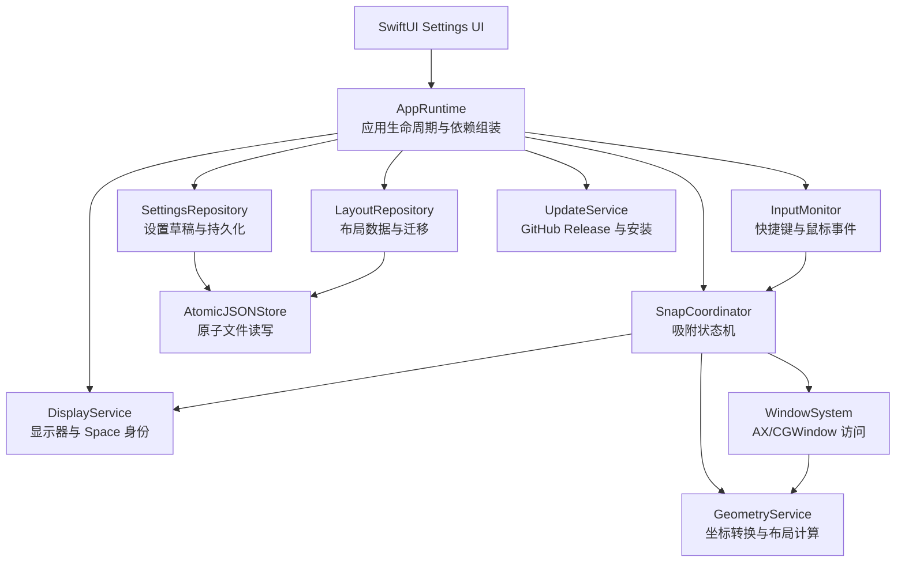

# MacsyZones 技术方案与实施文档

## 1. 文档信息

| 项目 | 内容 |
| --- | --- |
| 项目 | MacsyZones 中文定制版 |
| 文档状态 | 方案设计 + Goal 验收规范，待分阶段实施 |
| 基线版本 | v1.2.5 |
| 当前分支 | `custom` |
| 上游仓库 | `rohanrhu/MacsyZones` |
| 本项目仓库 | `jiezhengj/MacsyZones` |
| Bundle ID | `MeowingCat.MacsyZones` |
| 最低 macOS | 12.0 |
| 当前构建工具 | Xcode 27 beta |
| 配置目录 | `~/Library/Application Support/MeowingCat.MacsyZones/` |

本文档将当前项目的代码审查结果整理为一套可执行的重构方案。方案重点解决三类问题：

1. 显示器拔插后，配置选择和实际生效布局不一致。
2. Fork 和多轮 Agent 修改后，代码边界模糊、全局状态过多、维护成本升高。
3. 设置窗口和权限/更新界面与现代 macOS 原生体验存在差距。

本文档描述目标设计和实施步骤，不代表所有方案已经落地。本文档第 19 节同时定义 Goal 模式的范围、状态、证据和结束条件。实施时必须一次只执行一个阶段，按阶段提交、构建和验证，避免一次性重写导致功能退化。

---

## 2. 背景与问题定义

### 2.1 显示器布局错配问题

应用同时存在三种不同概念：

- **物理显示器**：内置显示器、外接显示器。
- **桌面空间**：macOS Mission Control 中的 Space。
- **逻辑布局**：用户创建的“小屏”“大屏”等布局配置。

过去部分代码把显示器数组下标当作显示器身份，另一部分代码使用 macOS 的显示器 ID。显示器拔插或系统重新排序后，同一个下标可能指向另一台显示器，从而出现以下状态：

```text
设置界面显示：当前选择“小屏”
实际运行时：窗口按“大屏”布局吸附
```

正确的配置键应该是：

```text
(稳定的物理 DisplayID, 当前 Space) -> LayoutID
```

而不是：

```text
(NSScreen.screens 的数组下标, 当前 Space) -> LayoutID
```

当前版本已经完成第一轮修复：

- 设置界面使用稳定显示器 ID，而不是数组索引。
- 焦点显示器失效时会校验连接状态并回退到当前主显示器。
- 单显示器场景会迁移旧的 `screen: 0` 配置。

后续应把这套修复提升为明确的数据模型和迁移机制，避免继续依赖隐式约定。

### 2.2 Fork 后的代码演进问题

当前项目已经删除了上游的商业限制相关代码：

- `ProLock.swift`
- `PubKey.swift`
- `DonationReminder.swift`

同时删除了上游旧版设置入口和教程视频，并将设置功能整合到：

- `SettingsState.swift`
- `SettingsView.swift`
- `SettingsWindowManager.swift`
- `ShortcutInputView.swift`

这解决了商业限制和中文定制需求，但也产生了新的维护问题：

- 设置功能集中在一个约 900 行的 SwiftUI 文件中。
- `App.swift` 和 `Macsy.swift` 仍然拥有大量全局状态和自由函数。
- 持久化模型和 AppKit 运行时窗口对象耦合。
- AX、CGWindow、鼠标监听、吸附状态机和布局计算交织在一起。
- 多轮修复使用了多个 `DispatchQueue.main.asyncAfter` 延时，状态时序不够明确。

### 2.3 签名与发布约束

本项目是个人自用版本，不依赖付费 Apple Developer Program。当前使用 Xcode 登录的免费 Apple Development 证书签名：

```text
证书：Apple Development: jie.zhengj@qq.com (8SDSF987N2)
Team ID：74FR87HYTH
证书 SHA-1：C7C84AAA3B67FACEA73042570A0BA2FC3D19E613
```

必须保持以下约束：

- 不使用 ad-hoc 签名作为正式本地构建方案。
- 保持 Bundle ID 不变，以保留辅助功能权限和应用配置。
- 发布前验证签名身份、Team ID、Bundle ID 和代码签名有效性。
- DMG 只在 `/tmp` 创建，不进入 Git。
- GitHub Release 只推送到 `jiezhengj/MacsyZones`，不向上游推送。

---

## 3. 目标、非目标与设计原则

### 3.1 目标

#### 功能目标

- 显示器拔插、重连、排列变化后，布局仍然按正确的物理显示器生效。
- 支持按显示器和 Space 选择不同布局。
- 保留区域布局、网格布局、快速吸附、摇晃吸附、窗口循环和布局编辑能力。
- 设置修改具有明确的保存、取消、重置和迁移语义。
- 更新功能只下载项目 Release 中匹配版本的 DMG。
- 发布构建可重复验证，使用固定 Apple Development 证书。

#### 工程目标

- 消除无用代码和私有 API。
- 降低全局状态数量，明确模块职责和依赖关系。
- 将纯数据、平台服务、运行时状态和 UI 分离。
- 为显示器映射、配置迁移、几何计算和更新解析补充自动化测试。
- 保持与上游同步时的可维护性，尽量将上游功能和本项目定制分层。

#### 体验目标

- 设置窗口符合 macOS 原生设置习惯。
- 让用户能明确区分“显示器”“Space”和“布局”。
- 权限、更新失败、重置等高风险操作有清晰提示和可恢复路径。
- 支持键盘操作、辅助功能和系统深色模式。

### 3.2 非目标

本次方案不包含：

- 加入付费 Pro 许可证。
- 加入第三方云同步。
- 支持 iOS 或 iPadOS。
- 将项目改造成 App Store 分发版本。
- 一次性重写全部窗口吸附算法。
- 为了追求“现代化”而删除核心布局编辑能力。

### 3.3 设计原则

1. **先建立测试和边界，再重构实现。**
2. **稳定身份优先于数组位置。**
3. **纯数据模型不依赖 AppKit 窗口对象。**
4. **平台 API 集中封装，业务逻辑不直接散落调用 AX/CGWindow。**
5. **运行时状态显式建模，不依赖全局布尔变量组合推断状态。**
6. **优先复用上游经过验证的功能逻辑，定制层只承担汉化、个人配置和必要修复。**
7. **每个阶段都能独立构建、验证和回滚。**

---

## 4. 当前代码基线审查

### 4.1 当前主要模块

| 文件 | 当前职责 | 主要问题 | 目标方向 |
| --- | --- | --- | --- |
| `App.swift` | 生命周期、菜单栏、权限、监听器、更新入口 | 全局状态过多、职责过宽 | `AppRuntime`、`StatusBarController`、`EventMonitor` |
| `Macsy.swift` | 吸附流程、窗口操作、AX/CGWindow、鼠标处理 | 约 1200 行，状态机和平台访问混合 | `SnapCoordinator`、`WindowService`、`GeometryService` |
| `Layout.swift` | 区域编辑、窗口覆盖层、网格编辑、面板 | 约 2200 行，多个 UI/运行时职责混合 | 编辑器、覆盖层、窗口控制器拆分 |
| `UserData.swift` | 数据模型、文件读写、布局运行时窗口 | 模型与 AppKit 耦合、强制解包 | `Models`、`Persistence`、`Runtime` 分离 |
| `Settings.swift` | 设置模型、默认值、全局设置对象 | 字段大量可选、兼容逻辑隐式 | 版本化 `SettingsData` |
| `Preferences.swift` | 显示器/Space 到布局的映射 | 使用 `Int` 表达物理显示器 | `DisplayID`、`SpaceKey` |
| `SettingsState.swift` | 设置草稿、脏状态、保存撤销 | 手动复制和比较字段 | `SettingsDraft` 整体值语义 |
| `SettingsView.swift` | 所有设置页面、布局操作、关于入口 | 单文件过大、固定尺寸、非原生控件较多 | Sidebar + 多个设置页面 |
| `SettingsWindowManager.swift` | 创建和显示设置窗口 | 浮动层级和延时恢复 | 标准窗口控制器 |
| `Updater.swift` | GitHub API、下载、挂载、替换应用 | 回调多、资产选择不严格、更新脚本风险 | `UpdateService` + 安全校验 |
| `Info.swift` | 权限和更新失败界面 | 自绘面板置顶、旧网站链接 | 标准窗口/系统设置链接 |
| `LiquidGlass.swift` | 私有玻璃效果封装 | 当前没有调用点，依赖私有 API | 删除 |

### 4.2 已确认的精简候选

#### 可以优先删除

`LiquidGlass.swift` 当前只有文件内部引用，没有任何实际调用点；同时使用了私有 `NSGlassEffectView` 和私有 setter。删除后应执行 Debug/Release 构建和资源检查。

#### 可以整理但不能直接删除

- `showSwitcher`、`isSwitcherUsed`：旧文件已经删除，但运行时仍有相关逻辑，需先确认功能是否保留。
- AppIcon 中哈希相同的 PNG：它们可能对应不同的 asset rendition，需修改 `Contents.json` 后再测试，不能只删除文件。
- Onboarding：当前仍被启动流程使用，应重做内容，不应盲目删除。
- Updater：项目仍然通过 GitHub Release 发布 DMG，因此不能删除，只能重构和加固。

#### 非运行时瘦身

`AGENTS.md` 与 `CLAUDE.md` 的维护规则大量重复。建议保留一份完整的工程规则，另一份只保留工具入口和指向主文档的说明。此项不会减少 App 体积，但会降低维护和文档漂移成本。

---

## 5. 目标架构

### 5.1 总体分层



### 5.2 目标目录结构

项目当前使用 Xcode 的文件系统同步组，`MacsyZones/` 目录下的新 Swift 文件会自动进入 Target，但每次新增后仍需执行构建确认。

建议逐步调整为以下结构：

```text
MacsyZones/
├── App/
│   ├── MacsyZonesApp.swift
│   ├── AppRuntime.swift
│   ├── StatusBarController.swift
│   └── AppEventCoordinator.swift
├── Domain/
│   ├── DisplayID.swift
│   ├── LayoutModels.swift
│   ├── SettingsModels.swift
│   ├── SpaceKey.swift
│   └── WindowModels.swift
├── Persistence/
│   ├── AtomicJSONStore.swift
│   ├── LayoutRepository.swift
│   ├── SettingsRepository.swift
│   └── MigrationCoordinator.swift
├── Display/
│   ├── DisplayService.swift
│   ├── DisplayTopology.swift
│   ├── SpaceService.swift
│   └── DisplayCoordinateConverter.swift
├── WindowSystem/
│   ├── AXWindowService.swift
│   ├── AXObserverCoordinator.swift
│   ├── CGWindowService.swift
│   └── WindowReference.swift
├── Snapping/
│   ├── SnapCoordinator.swift
│   ├── SnapState.swift
│   ├── ZoneEngine.swift
│   ├── GridEngine.swift
│   ├── WindowCyclingService.swift
│   └── QuickSnapSession.swift
├── Input/
│   ├── GlobalHotkey.swift
│   ├── InputMonitor.swift
│   └── ShortcutParser.swift
├── LayoutEditor/
│   ├── LayoutEditorController.swift
│   ├── LayoutOverlayWindow.swift
│   ├── ZoneEditorView.swift
│   └── GridEditorView.swift
├── SettingsUI/
│   ├── SettingsWindowController.swift
│   ├── SettingsView.swift
│   ├── DisplaySettingsView.swift
│   ├── ShortcutSettingsView.swift
│   ├── BehaviorSettingsView.swift
│   ├── AdvancedSettingsView.swift
│   └── SettingsDraft.swift
├── Update/
│   ├── UpdateService.swift
│   ├── GitHubReleaseClient.swift
│   ├── Version.swift
│   └── UpdateInstaller.swift
└── Support/
    ├── AccessibilityPermissionView.swift
    ├── Onboarding.swift
    ├── Logging.swift
    └── Constants.swift
```

这不是要求立即移动所有文件。第一阶段可以保留旧文件名，通过新类型逐步承接职责，最后再整理文件目录。

---

## 6. 核心数据模型设计

### 6.1 物理显示器身份

不要再用裸 `Int` 表示显示器。建议定义语义类型：

```swift
struct DisplayID: Hashable, Codable, Sendable {
    let rawValue: UInt32
}
```

从 `NSScreen` 获取：

```swift
extension NSScreen {
    var macsyDisplayID: DisplayID? {
        guard let number = deviceDescription[ NSDeviceDescriptionKey("NSScreenNumber") ] as? NSNumber else {
            return nil
        }
        return DisplayID(rawValue: number.uint32Value)
    }
}
```

注意事项：

- 数组索引只能用于 UI 列表位置。
- 配置文件、运行时映射和日志必须使用 `DisplayID`。
- 如果系统无法提供 DisplayID，不应静默回退为数组索引并写入持久化配置。
- 可以在 UI 中显示显示器名称，但名称不是稳定身份，因为用户可以连接两台同名显示器。

### 6.2 Space 与布局键

```swift
struct SpaceID: Hashable, Codable, Sendable {
    let rawValue: UInt64
}

struct ScreenSpaceKey: Hashable, Codable, Sendable {
    let displayID: DisplayID
    let spaceID: SpaceID
}
```

当前实现用 `spaceNumber` 表示 Space 在显示器上的顺序，例如第 1 个、第 2 个 Space。长期方案应优先保存 macOS 的 `ManagedSpaceID`，因为顺序可能因用户调整而变化。

兼容阶段可以同时保存：

```swift
struct SpaceReference: Codable, Hashable {
    let managedSpaceID: UInt64?
    let legacyOrdinal: Int?
}
```

读取时优先使用 `managedSpaceID`，找不到时再用旧 ordinal 兼容。

### 6.3 布局模型与运行时对象分离

建议将目前的 `UserLayout` 拆成两个概念：

```swift
struct LayoutDefinition: Codable, Identifiable, Equatable {
    let id: UUID
    var name: String
    var type: LayoutType
    var sections: [SectionDefinition]
    var grid: GridDefinition?
}

struct SectionDefinition: Codable, Identifiable, Equatable {
    let id: UUID
    var order: Int
    var frame: NormalizedRect
}

struct NormalizedRect: Codable, Equatable {
    var x: Double
    var y: Double
    var width: Double
    var height: Double
}

final class LayoutRuntime {
    let definition: LayoutDefinition
    // LayoutWindow、SectionWindow、GridLayoutWindow 等 AppKit 对象
}
```

好处：

- JSON 不再依赖窗口对象。
- 布局编辑器可以单独测试。
- 布局重命名、复制和删除使用 UUID，而不是依赖名称或数字编号。
- 名称只用于显示，不能作为唯一身份。

### 6.4 设置模型

当前 `AppSettingsData` 为了兼容旧文件，字段大量可选。建议把兼容责任放到解码迁移层，业务层只使用完整非可选模型：

```swift
struct SettingsData: Codable, Equatable {
    var modifierKey: ModifierKey
    var snapKey: SnapKey
    var modifierKeyDelayMilliseconds: Int
    var fallbackToPreviousSize: Bool
    var onlyFallbackToPreviousSizeWithUserEvent: Bool
    var selectPerDesktopLayout: Bool
    var prioritizeCenterToSnap: Bool
    var shakeToSnap: Bool
    var shakeAccelerationThreshold: Double
    var snapResize: Bool
    var snapResizeThreshold: Double
    var quickSnapShortcut: Shortcut
    var snapWithRightClick: Bool
    var showSnapResizersOnHover: Bool
    var cycleWindowsForwardShortcut: Shortcut
    var cycleWindowsBackwardShortcut: Shortcut
    var snapHighlightStrategy: SnapHighlightStrategy
}
```

### 6.5 配置文件格式与版本

每个配置文件建议增加统一外壳：

```swift
struct PersistedDocument<Payload: Codable>: Codable {
    var schemaVersion: Int
    var updatedAt: Date
    var payload: Payload
}
```

建议版本：

| 版本 | 内容 |
| --- | --- |
| 1 | 当前旧格式，无 schema 标记 |
| 2 | 显示器配置从数组索引迁移为稳定 DisplayID |
| 3 | Space 从 ordinal 增加 ManagedSpaceID |
| 4 | 布局由名称/数字编号迁移到 UUID |

迁移要求：

- 迁移必须幂等，执行多次结果相同。
- 原始文件在迁移前复制为 `.backup`。
- 迁移失败时保留原文件，不覆盖用户数据。
- 日志记录文件名、旧版本、新版本和迁移结果。
- 对无法判断的显示器映射不进行静默猜测。

---

## 7. 显示器与布局映射方案

### 7.1 DisplayService 职责

`DisplayService` 是本项目解决显示器问题的核心服务，负责：

- 读取当前显示器列表。
- 获取稳定 `DisplayID`。
- 监听 `NSApplication.didChangeScreenParametersNotification`。
- 判断某个 DisplayID 是否仍然在线。
- 提供显示器名称、frame、visibleFrame、缩放信息。
- 提供统一的 AppKit 坐标与 Accessibility 坐标转换。
- 在显示器拓扑变化后发布新的 `DisplayTopology`。

```swift
struct DisplayDescriptor: Identifiable, Equatable {
    let id: DisplayID
    let name: String
    let frame: CGRect
    let visibleFrame: CGRect
    let isBuiltIn: Bool
}

struct DisplayTopology: Equatable {
    let displays: [DisplayDescriptor]
    let timestamp: Date
}
```

### 7.2 布局选择流程

```text
应用启动
  ↓
读取当前 DisplayTopology
  ↓
识别当前焦点窗口所在显示器
  ↓
获取当前 ManagedSpaceID
  ↓
构造 ScreenSpaceKey(DisplayID, SpaceID)
  ↓
从 LayoutRepository 查询 LayoutID
  ↓
加载对应 LayoutRuntime
  ↓
显示或隐藏布局覆盖层
```

### 7.3 显示器拔插流程

```text
收到屏幕参数变化通知
  ↓
DisplayService 刷新拓扑
  ↓
关闭旧显示器上的编辑器、预览和吸附覆盖层
  ↓
重新获取焦点窗口、DisplayID 和 SpaceID
  ↓
查询新的 ScreenSpaceKey
  ↓
如果配置存在：切换到对应布局
如果配置不存在：使用当前默认布局，但不写入错误映射
  ↓
刷新设置界面的显示器列表和当前布局状态
```

### 7.4 旧配置迁移策略

第一阶段迁移规则：

1. 如果文件已经包含稳定 DisplayID，不再迁移。
2. 如果只有一个显示器，旧 `screen: 0` 映射到当前唯一显示器的 DisplayID。
3. 如果有多个显示器且旧配置只有数组索引，不能自动确定物理身份，应：
   - 保留原始配置备份。
   - 记录警告日志。
   - 在设置界面显示一次性迁移提示。
   - 允许用户手动把旧布局映射到当前显示器。
4. 迁移完成后写入 schema version，避免每次启动重复迁移。

当前版本只覆盖了“单显示器时 screen 0 无歧义”的安全场景。后续应补充多显示器旧配置的交互式迁移。

---

## 8. 持久化设计

### 8.1 AtomicJSONStore

统一文件存储服务：

```swift
actor AtomicJSONStore {
    let directory: URL

    func load<T: Decodable>(_ type: T.Type, from filename: String) throws -> T
    func save<T: Encodable>(_ value: T, to filename: String) throws
    func backup(filename: String) throws
}
```

保存步骤：

1. 编码到内存。
2. 写入同一目录的临时文件。
3. 对临时文件执行文件保护和 flush。
4. 用 `FileManager.replaceItem` 原子替换目标文件。
5. 必要时保留上一版本备份。

禁止继续使用：

```swift
data.write(to: filePath, atomically: false, encoding: .utf8)
```

### 8.2 配置对象生命周期

不要在基类 `UserData` 初始化过程中通过动态派发调用子类 `load()`。建议改成：

```text
创建 Repository
  ↓
AtomicJSONStore.load
  ↓
MigrationCoordinator.migrate
  ↓
Repository 保存纯数据模型
  ↓
需要时创建 LayoutRuntime
```

这样可以避免 Swift 初始化阶段的动态派发风险，也避免加载配置时提前创建大量 AppKit 窗口对象。

### 8.3 配置损坏恢复

读取失败时按以下顺序处理：

1. 尝试读取当前文件。
2. 读取 `.backup` 文件。
3. 如果备份可用，恢复备份并记录日志。
4. 如果备份也不可用，加载默认配置。
5. 不删除损坏原文件，重命名为 `.corrupted-<timestamp>` 供排查。

---

## 9. 窗口系统和吸附引擎设计

### 9.1 WindowReference

窗口不能以标题作为唯一身份。建议定义：

```swift
struct WindowReference: Hashable, Sendable {
    let processID: pid_t
    let windowID: CGWindowID?
    let titleAtCapture: String?
}
```

标题只作为日志和调试信息，不参与唯一匹配。

### 9.2 AXWindowService

负责：

- 获取前台应用和焦点窗口。
- 读取窗口位置和尺寸。
- 设置窗口位置和尺寸。
- 判断窗口是否可移动、可调整大小。
- 管理 AXObserver 注册和注销。
- 处理应用启动、退出、窗口新增和窗口销毁。

业务层只依赖协议：

```swift
protocol WindowService {
    func focusedWindow() -> WindowReference?
    func frame(of window: WindowReference) -> CGRect?
    func setFrame(_ frame: CGRect, for window: WindowReference) throws
    func isMovable(_ window: WindowReference) -> Bool
}
```

### 9.3 SnapCoordinator

当前代码用多个全局布尔变量表达状态，例如 fitting、editing、quick snapping、snap resizing 等。建议改成一个状态枚举：

```swift
enum SnapState: Equatable {
    case idle
    case editing(layoutID: UUID)
    case showingZones(layoutID: UUID)
    case showingGrid(layoutID: UUID, anchor: CGPoint)
    case movingWindow(WindowReference)
    case resizingWindow(WindowReference, zoneID: UUID)
    case quickSnapping(WindowReference)
}
```

状态转换必须集中在 `SnapCoordinator`，禁止其他模块直接修改状态变量。

### 9.4 几何计算

建立独立的 `GeometryService`：

- 规范化矩形与屏幕可见区域之间的转换。
- AppKit 左下角坐标与 Accessibility 左上角坐标之间的转换。
- Retina 缩放处理。
- 多显示器上下左右排列处理。
- Dock、菜单栏和刘海区域处理。
- 网格单元计算和边界夹紧。

所有计算函数都应该是纯函数，输入明确、输出明确，不直接读取 `NSScreen.screens.first!`。

---

## 10. 并发和事件处理

### 10.1 线程模型

建议约定：

- UI 和 App 生命周期：`@MainActor`。
- 配置读写：`AtomicJSONStore` actor。
- AX/CGWindow 访问：统一由 `WindowSystem` 管理，避免多个线程同时操作同一窗口引用。
- 网络更新：`URLSession` async/await。
- 所有事件监听都有对应的取消和注销路径。

### 10.2 替换延时驱动逻辑

当前代码存在多个 `asyncAfter(0.1)`、`asyncAfter(0.5)` 和 `asyncAfter(1.0)`。延时只应作为平台事件没有回调时的最后手段。

替换方向：

- 使用通知或窗口状态回调确认状态完成。
- 对必须重试的操作使用带取消能力的 `RetryPolicy`。
- 给每次显示器拓扑刷新设置 generation token，旧任务完成时不得覆盖新状态。
- 设置窗口显示层级不依赖“0.5 秒后恢复 normal”。

```swift
struct RetryPolicy {
    let maxAttempts: Int
    let delay: Duration
}
```

### 10.3 资源清理

应用退出或权限失效时，必须统一清理：

- 全局鼠标监听。
- 快捷键注册。
- AXObserver。
- Space 和显示器通知。
- 布局覆盖层窗口。
- 临时更新文件。

建议由 `AppRuntime.shutdown()` 统一调用，避免只清理其中一个监听器。

---

## 11. 设置界面设计

### 11.1 信息架构

建议将当前顶部显示器 Tab 改为 Sidebar：

```text
MacsyZones 设置
├── 显示器
│   ├── 内置显示器
│   └── 外接显示器
├── 快捷键
├── 吸附行为
├── 窗口循环
├── 高级设置
└── 关于与更新
```

显示器页面应同时展示：

- 显示器名称。
- 内置/外接标识。
- 当前连接状态。
- 当前 Space。
- 当前生效布局。
- 布局配置键对应的稳定 DisplayID 的简短诊断信息。

这样用户可以直接看到“哪台显示器正在使用哪个布局”，避免“小屏”和“大屏”只作为模糊的布局名称出现。

### 11.2 原生控件

优先使用：

- `NavigationSplitView` 或标准 Sidebar。
- `Form`。
- `Section`。
- `LabeledContent`。
- 系统 `Toggle`、`Picker`、`Stepper`、`Slider`。
- `ControlGroup`。
- `.confirmationDialog`。
- `ButtonRole.destructive`。
- 系统 `.tint` 和 `.secondary` 颜色。

减少以下做法：

- 固定窗口尺寸。
- 手动绘制蓝色/红色按钮。
- 只显示 SF Symbol 而没有文字和辅助功能标签。
- 自定义圆角背景模拟系统按钮。
- 使用 HUD 或 screen-saver level 强制覆盖其他应用。

### 11.3 布局管理交互

当前布局操作有编辑、重命名、复制、新建、删除等多个无文字图标按钮。建议改成：

```text
[布局选择器                     ] [编辑]
[布局预览卡片                    ]
[新建 ▾] [复制] [重命名] [更多…]
```

删除操作放入“更多…”菜单，并使用标准确认对话框。布局名称重复、空名称和默认布局不可删除等规则统一由 `LayoutRepository` 校验，而不是由多个 View 分别判断。

### 11.4 保存与取消

保留当前的草稿式编辑体验，但做以下调整：

- 没有修改时禁用“确定”。
- 有未保存修改时在窗口标题显示提示。
- 取消时只丢弃草稿，不修改运行时设置。
- 确定时一次性提交设置、布局选择和快捷键。
- 重置默认值明确区分“当前页面”“当前显示器”“全部设置”。
- 重置前显示影响范围和配置备份位置。

### 11.5 权限和更新界面

权限界面应：

- 使用普通窗口或标准 `NSAlert`。
- 提供“打开系统设置”按钮。
- 显示当前权限状态，而不是只展示截图教程。
- 不使用 `.screenSaver` 层级，不覆盖所有 Space。
- 用户授予权限后提供“重新检查”按钮。

更新失败界面应：

- 链接到 `https://github.com/jiezhengj/MacsyZones/releases`。
- 显示当前版本和失败原因。
- 提供“继续使用当前版本”和“打开 Release 页面”。
- 不再显示旧的 `macsyzones.com` 地址。

### 11.6 可访问性和本地化

- 所有图标按钮提供 `.accessibilityLabel` 和 `.help`。
- 支持键盘焦点、Tab 导航和默认/取消按钮快捷键。
- 避免固定过小字体和固定高度。
- 使用系统语义颜色，支持浅色和深色模式。
- 中文字符串集中管理，后续可加入英文资源。
- 显示器名称和布局名称必须正确转义和截断显示。

---

## 12. 更新器设计

### 12.1 GitHub Release 读取

定义明确的数据结构：

```swift
struct GitHubRelease: Decodable {
    let tagName: String
    let assets: [GitHubAsset]
}

struct GitHubAsset: Decodable {
    let name: String
    let browserDownloadURL: URL
    let size: Int
}
```

选择规则：

1. HTTP 状态必须为 2xx。
2. Tag 只移除开头的 `v`，不能使用全局字符串替换。
3. 只选择名称匹配 `MacsyZones-v<version>.dmg` 的资产。
4. 不使用 `assets.first`。
5. 版本号使用明确的 `Version` 类型比较。
6. 如果没有匹配 DMG，显示可理解的错误，而不是开始下载其他文件。

### 12.2 下载与安装

下载阶段：

- 使用临时目录和唯一文件名。
- 校验下载大小和 HTTP 响应。
- 下载完成后再通知 UI。
- 允许取消和清理临时文件。

安装阶段：

1. 挂载 DMG。
2. 确认存在 `MacsyZones.app`。
3. 读取目标 App 的 Bundle ID 和版本号。
4. 验证代码签名和 Bundle ID。
5. 将当前 App 移动到可恢复备份位置。
6. 原子替换到 `/Applications/MacsyZones.app`。
7. 卸载 DMG。
8. 启动新版本。
9. 更新状态文件。

不应继续使用未经严格校验的字符串拼接 shell 脚本完成全部安装逻辑。即使是个人自用版本，也要避免目标路径、临时路径或下载文件名进入 shell 时产生意外解析。

### 12.3 更新失败恢复

更新状态至少包含：

```swift
struct UpdateAttempt: Codable {
    let currentVersion: String
    let targetVersion: String
    let startedAt: Date
    var stage: UpdateStage
}

enum UpdateStage: String, Codable {
    case downloaded
    case mounted
    case validated
    case replaced
    case relaunched
    case failed
}
```

下次启动时：

- 如果目标版本已经启动成功，清除状态。
- 如果替换失败，保留当前版本并提示用户。
- 如果存在旧 App 备份，允许恢复。

---

## 13. 签名、构建与 Release 方案

### 13.1 签名原则

当前个人自用场景使用免费 Apple Development 证书即可。正式构建必须使用固定证书，不能切换为 ad-hoc。

共享构建配置应固定：

```text
PRODUCT_BUNDLE_IDENTIFIER = MeowingCat.MacsyZones
DEVELOPMENT_TEAM = 74FR87HYTH
MACOSX_DEPLOYMENT_TARGET = 12.0
```

证书选择建议从项目文件中抽离到本机私有 `.xcconfig`：

```text
// Signing.local.xcconfig，不提交 Git
CODE_SIGN_STYLE = Manual
CODE_SIGN_IDENTITY = Apple Development: jie.zhengj@qq.com (8SDSF987N2)
```

这样可以同时达到两个目标：

- 当前机器构建仍使用固定证书，保持稳定 CDHash。
- 项目源代码不会完全绑定另一台机器不存在的证书名称。

如果继续把证书名称写在 `project.pbxproj` 中，至少要在构建脚本中验证证书是否存在，并在缺失时给出明确错误。

### 13.2 Debug 构建

```bash
DEVELOPER_DIR=/Applications/Xcode-beta.app/Contents/Developer \
xcodebuild \
  -project MacsyZones.xcodeproj \
  -scheme MacsyZones \
  -configuration Debug \
  -derivedDataPath /private/tmp/MacsyZones-debug \
  clean build
```

### 13.3 Release 构建

```bash
DEVELOPER_DIR=/Applications/Xcode-beta.app/Contents/Developer \
xcodebuild \
  -project MacsyZones.xcodeproj \
  -scheme MacsyZones \
  -configuration Release \
  -derivedDataPath /private/tmp/MacsyZones-release \
  clean build
```

### 13.4 签名验证

```bash
APP=/private/tmp/MacsyZones-release/Build/Products/Release/MacsyZones.app

codesign -dv --verbose=4 "$APP" 2>&1 | \
  grep -E "CDHash|Signature|Identifier|Authority|TeamIdentifier"

codesign --verify --deep --strict --verbose=2 "$APP"

defaults read "$APP/Contents/Info.plist" \
  CFBundleShortVersionString CFBundleVersion CFBundleIdentifier
```

必须确认：

- `Identifier=MeowingCat.MacsyZones`
- `TeamIdentifier=74FR87HYTH`
- 使用预期 Apple Development 证书。
- `codesign --verify --deep --strict` 成功。
- 版本号与项目 Release 标签一致。

### 13.5 DMG 构建

DMG 全程在 `/tmp` 中创建：

```bash
VERSION=1.2.5
DMG_ROOT=/tmp/MacsyZones-dmg
DMG_PATH=/tmp/MacsyZones-v${VERSION}.dmg
APP=/private/tmp/MacsyZones-release/Build/Products/Release/MacsyZones.app

mkdir -p "$DMG_ROOT"
cp -R "$APP" "$DMG_ROOT/"
ln -sf /Applications "$DMG_ROOT/Applications"

hdiutil create \
  -volname "MacsyZones" \
  -srcfolder "$DMG_ROOT" \
  -ov \
  -format UDZO \
  "$DMG_PATH"

hdiutil verify "$DMG_PATH"
```

上传完成后删除临时文件：

```bash
rm -f "$DMG_PATH"
rm -rf "$DMG_ROOT"
```

### 13.6 GitHub Release

发布顺序：

1. 更新 `MARKETING_VERSION`。
2. 构建 Release。
3. 验证 App 签名。
4. 创建并验证 DMG。
5. 提交源代码。
6. 创建并推送 tag。
7. 创建 GitHub Release。
8. 上传 DMG。
9. 确认 Release 资产可下载。
10. 删除本地 DMG。

Release 标题：

```text
MacsyZones 中文定制版 v1.2.6
```

Release 正文必须遵循项目现有模板，并明确上游版本映射。

---

## 14. 分阶段实施计划

### 阶段 0：建立基线和测试保护

目标：在重构前确认当前行为。

任务：

- 保存当前 Release 构建和签名验证结果。
- 为显示器配置、布局选择和几何转换增加纯函数测试入口。
- 记录当前配置文件样例，并复制到测试 fixture。
- 记录当前窗口吸附的关键手动测试流程。
- 删除或移动 Xcode 用户状态等生成文件，不纳入源代码。

验收：

- Debug/Release 都能构建。
- 现有配置可以被读取。
- 多显示器拔插场景有可重复测试步骤。

### 阶段 1：安全精简

目标：减少没有运行时价值的代码和风险。

任务：

- 删除无引用的 `LiquidGlass.swift`。
- 清理私有 API 相关代码和配置。
- 合并 `SettingsView` 中重复的辅助函数。
- 整理 AppIcon 资源，但只删除经过 Asset Catalog 验证的重复资源。
- 合并重复工程文档，保留一份权威发布流程。
- 更新 `Info.swift` 中旧网站链接。

验收：

- 构建无编译错误和资源缺失。
- `rg` 搜索不到 `LiquidGlass` 和 `NSGlassEffectView` 引用。
- 权限、关于、更新失败界面仍可打开。

### 阶段 2：显示器身份和持久化重构

目标：彻底建立稳定显示器配置模型。

任务：

- 新增 `DisplayID`、`SpaceID`、`ScreenSpaceKey`。
- 新增 `DisplayService` 和 `DisplayCoordinateConverter`。
- 给 `SpaceLayoutPreferences` 增加 schema version。
- 实现单显示器安全迁移和多显示器交互式迁移提示。
- 将 `screenLayoutSelections` 从数组索引语义改为 DisplayID 语义。
- 将布局选择从名称改为 LayoutID，名称仅用于显示。

验收：

- 内置显示器和外接显示器可以分别保存布局。
- 拔掉外接显示器后，内置显示器不会读取外接显示器布局。
- 外接显示器重新连接后，仍能恢复原配置。
- 显示器重新排列后，配置仍按物理显示器匹配。
- 启动、Space 切换和屏幕参数变化都使用同一套查询逻辑。

### 阶段 3：持久化与运行时解耦

目标：让配置数据不依赖 AppKit 窗口对象。

任务：

- 新增 `AtomicJSONStore`。
- 将 `UserData` 的读写逻辑迁移到 Repository。
- 增加原子保存、备份、损坏恢复。
- 将 `UserLayout` 拆为 `LayoutDefinition` 和 `LayoutRuntime`。
- 将 `AppSettingsData` 迁移为完整非可选 `SettingsData`。
- 用 `SettingsDraft` 替换手动字段复制和比较。

验收：

- 配置写入中断不会产生半个 JSON。
- 缺少字段、旧版本字段和损坏文件均有明确处理结果。
- UI 测试可以使用纯数据模型，不需要创建真实布局窗口。

### 阶段 4：窗口系统和吸附状态机重构

目标：降低 `Macsy.swift` 和 `App.swift` 的复杂度。

任务：

- 新增 `WindowReference` 和 `AXWindowService`。
- 集中管理 AXObserver 生命周期。
- 提取 `GeometryService`。
- 用 `SnapState` 替换分散的全局布尔状态。
- 将鼠标、快捷键和窗口事件通过 `InputMonitor` 送入 `SnapCoordinator`。
- 删除重复的窗口查找和坐标转换实现。

验收：

- 窗口拖动、区域吸附、网格吸附和快速吸附行为不变。
- 应用退出时所有监听器都能清理。
- 多显示器和不同坐标排列的几何测试通过。
- 不再依赖窗口标题作为唯一匹配条件。

### 阶段 5：设置界面现代化

目标：让设置窗口符合 macOS 原生交互规范。

任务：

- 用 Sidebar 替换顶部自制显示器 Tab。
- 拆分设置页面文件。
- 使用 `Form`、`Section` 和系统控件。
- 增加显示器信息、当前 Space 和当前布局状态。
- 将布局操作收敛为布局选择器、预览和操作菜单。
- 使用标准确认对话框和系统权限设置链接。
- 记忆窗口位置和大小，支持调整窗口尺寸。

验收：

- 浅色/深色模式下显示正常。
- 键盘可以完成主要设置操作。
- VoiceOver 能识别主要控件。
- 用户能在一个页面明确看到当前显示器和生效布局。

### 阶段 6：更新器与发布流程加固

目标：降低更新失败和发布误操作风险。

任务：

- `GitHubAPI` 改为 `Decodable`。
- 精确匹配 DMG 资产。
- 引入明确版本比较类型。
- 增加 Bundle ID、版本和签名验证。
- 增加下载取消、临时文件清理和失败恢复。
- 将签名选择迁移到本机 `.xcconfig` 或构建参数。
- 在发布脚本中自动检查证书和 Team ID。

验收：

- Release 没有正确 DMG 时不会误下载其他资产。
- 目标 App Bundle ID 不匹配时安装中止。
- 更新失败后当前版本仍然可启动。
- 发布构建的签名和 CDHash 可重复验证。

---

## 15. 测试方案

### 15.1 纯单元测试

优先测试不依赖真实窗口和系统权限的代码：

- `DisplayID` 编解码。
- 旧显示器索引迁移。
- DisplayID 与 SpaceID 组合键。
- 显示器坐标转换。
- 网格行列和边界计算。
- 区域布局规范化矩形。
- 布局重命名、复制、删除和重复名称校验。
- `SettingsDraft` 保存、取消和重置。
- GitHub Release JSON 解析。
- DMG 资产匹配。
- 版本号比较。

### 15.2 配置迁移测试矩阵

| 场景 | 预期结果 |
| --- | --- |
| 新配置，无显示器映射 | 使用默认布局，不写入错误键 |
| 旧配置，只有一个显示器 | `screen: 0` 迁移到真实 DisplayID |
| 旧配置，多个显示器 | 不静默猜测，提示用户确认 |
| 显示器拔除 | 不使用已断开显示器的布局 |
| 显示器重新连接 | 通过 DisplayID 恢复布局 |
| 显示器顺序改变 | 布局仍按 DisplayID 匹配 |
| Space 顺序改变 | 优先通过 ManagedSpaceID 匹配 |
| 布局名称被重命名 | 通过 LayoutID 保持映射 |
| 配置文件损坏 | 恢复备份或加载默认配置 |

### 15.3 手动多显示器测试

每次涉及 DisplayService、Preferences 或布局选择时，至少执行：

1. 只连接内置显示器，选择布局 A。
2. 连接外接显示器，选择布局 B。
3. 确认两个显示器和当前 Space 的配置不同。
4. 拔掉外接显示器。
5. 从设置界面确认内置显示器仍选择布局 A。
6. 拖动窗口，确认实际吸附到布局 A。
7. 重新连接外接显示器。
8. 确认布局 B 仍然存在并可恢复。
9. 在系统设置中交换显示器排列。
10. 重复吸附测试，确认布局不随数组顺序错配。

### 15.4 构建后验证

```bash
xcodebuild -project MacsyZones.xcodeproj \
  -scheme MacsyZones \
  -configuration Debug \
  build
```

构建后检查：

- 应用可以启动。
- 菜单栏图标正常。
- 辅助功能权限流程正常。
- 设置窗口正常显示。
- 配置文件正确读取和写入。
- 没有运行时崩溃和明显错误日志。
- Release App 的签名和 Bundle ID 正确。

### 15.5 暂时无法自动化的内容

以下内容仍需要用户实机验证：

- 多显示器真实拔插。
- 不同显示器排列和缩放比例。
- 辅助功能授权后的窗口控制。
- 布局编辑器的视觉效果。
- 快速吸附、摇晃吸附和窗口拖动手感。
- 不同 macOS 版本和 Xcode beta 的兼容性。

---

## 16. 风险、取舍和回滚

### 16.1 主要风险

| 风险 | 影响 | 缓解措施 |
| --- | --- | --- |
| AX API 行为变化 | 窗口无法移动或调整 | 集中封装、记录错误码、保留旧实现作为回退 |
| 显示器身份无法读取 | 布局映射失败 | 不写入数组索引，显示迁移提示 |
| Space ID 不稳定或读取失败 | 当前布局选择失败 | 使用旧 ordinal 兼容，并显示当前状态 |
| 数据迁移错误 | 用户配置丢失 | 迁移前备份、幂等迁移、保留损坏文件 |
| 状态机重构退化 | 吸附交互异常 | 先增加行为测试，分模块替换 |
| 自定义 UI 改造影响用户习惯 | 学习成本上升 | 保留核心操作名称，分阶段发布 |
| 私有 API 依赖 | 新系统崩溃或构建失败 | 删除 `LiquidGlass.swift`，只用公开 API |
| 免费开发证书变化 | 无法构建或签名变化 | 构建前检查证书，保持证书名称和 Bundle ID 文档化 |
| Xcode beta 不稳定 | 构建失败 | 固定 `DEVELOPER_DIR`，保留已验证构建环境 |

### 16.2 回滚策略

每个阶段都应该单独提交：

```text
阶段 1：清理无用代码
阶段 2：显示器身份和迁移
阶段 3：持久化重构
阶段 4：窗口系统重构
阶段 5：设置 UI 重构
阶段 6：更新器加固
```

回滚时：

1. 回到上一个已验证的 Git 提交。
2. 不删除用户配置目录。
3. 如果已执行数据迁移，优先使用配置备份恢复。
4. 重新构建并验证签名。
5. 必要时发布补丁版本。

不允许用破坏性 Git 命令覆盖用户未提交的工作区，除非用户明确要求。

---

## 17. 实施检查清单

### 代码变更前

- [ ] 查看上游对应实现，确认是否可以复用。
- [ ] 确认改动属于本项目定制范围。
- [ ] 为涉及的迁移、几何和配置逻辑补充测试。
- [ ] 检查当前工作区是否存在用户改动。
- [ ] 确认新文件会被 Xcode Target 包含。

### 代码变更后

- [ ] `rg` 检查旧符号和私有 API 是否还有引用。
- [ ] Debug 构建成功。
- [ ] Release 构建成功。
- [ ] 配置读取和迁移测试通过。
- [ ] 多显示器手动测试通过。
- [ ] 设置窗口键盘和深色模式检查通过。
- [ ] 更新器解析和错误路径测试通过。

### 发布前

- [ ] 更新 `MARKETING_VERSION`。
- [ ] 确认 Bundle ID 未变化。
- [ ] 确认 Team ID 和签名证书正确。
- [ ] 验证 `codesign --verify --deep --strict`。
- [ ] 创建并验证 `/tmp/MacsyZones-vX.Y.Z.dmg`。
- [ ] 提交源代码并推送 `custom`。
- [ ] 创建并推送版本 tag。
- [ ] 创建 GitHub Release 并上传 DMG。
- [ ] 确认 Release 资产可下载。
- [ ] 删除本地 DMG 和临时目录。

---

## 18. 推荐的近期执行顺序

建议下一轮不要直接开始大规模架构重写，而按以下顺序推进。以下每一项都是独立 Goal，不应把 8 项合并成一个 Goal：

1. 删除未使用的 `LiquidGlass.swift`，修正更新器旧网址和 DMG 资产选择。
2. 为 DisplayID、显示器拔插、配置迁移和坐标转换补充测试。
3. 引入 `DisplayID`、`ScreenSpaceKey` 和 `DisplayService`，先替换配置读取路径。
4. 引入 `AtomicJSONStore`，再迁移设置和布局持久化。
5. 将 `SettingsState` 改为整体草稿模型。
6. 拆分 `Macsy.swift`，但每次只迁移一个职责。
7. 最后重做设置窗口 UI，避免 UI 改造掩盖底层状态问题。
8. 完成更新器和发布流程加固后，再发布下一个补丁或次版本。

这样可以先解决数据正确性和可恢复性，再处理内部架构，最后改善视觉和交互体验，风险最低，也最容易在每一步定位问题。

---

## 19. Goal 模式验收契约

本节是本项目实施时的强制验收规范。技术方案中的“目标”“任务”和“建议”不能直接等同于完成条件；只有本节定义的强制验收项全部通过，Goal 才可以标记为完成。

### 19.1 Goal 的基本粒度

一次 Goal 只能覆盖一个阶段或一个明确的交付结果。以下内容不得作为单个 Goal 的范围：

- “完成整份技术方案”。
- “完成所有架构优化”。
- “让项目整体更现代”。
- 同时修改数据层、窗口系统、UI 和发布流程但没有独立验收边界。

正确的 Goal 必须可以用一句话说明：

```text
在不改变既有吸附行为的前提下，完成 DisplayID 配置迁移，使显示器拔插、重连和排列变化后仍按物理显示器选择正确布局。
```

每个 Goal 必须在开始时明确以下信息：

| 字段 | 要求 |
| --- | --- |
| Goal ID | 唯一编号，例如 `G2-display-identity` |
| 目标一句话 | 可观察、可验证，不能只写“优化”“重构” |
| 包含范围 | 明确允许修改的文件、模块和行为 |
| 不包含范围 | 明确本 Goal 不处理的内容 |
| 前置条件 | 分支、工具链、权限、硬件和配置条件 |
| 交付物 | 代码、测试、文档、构建产物或 Release 资产 |
| 强制验收项 | 全部必须 PASS，不能以 UNKNOWN 代替 |
| 可延期项 | 非阻断的 P2/P3 改进，必须登记后续 Goal |
| 回滚点 | 对应的已验证提交或 tag |

### 19.2 状态定义

Goal 的状态只能使用以下定义：

| 状态 | 严格定义 | 是否可以结束当前 Goal |
| --- | --- | --- |
| `PASS` | 某一条验收项已执行，实际结果完全满足预期，并有证据 | 该验收项可以结束 |
| `FAIL` | 某一条验收项已执行，实际结果不满足预期 | 不可以 |
| `UNKNOWN` | 尚未执行、无法重现、缺少日志/测试结果/用户确认，或结果存在歧义 | 不可以 |
| `BLOCKED` | 需要 Goal 范围外的外部条件，且已完成范围内的排查和替代方案 | 不可以直接标记完成 |
| `COMPLETE` | 所有强制验收项为 `PASS`，没有强制项为 `FAIL` 或 `UNKNOWN`，且所有必需交付物已完成 | 可以结束 |

特别规定：

1. “代码看起来正确”只能是分析结论，不是 `PASS`。
2. “构建成功”不能替代运行时、配置迁移或用户交互验收。
3. “用户还没有测试”必须记为 `UNKNOWN`，不能记为 `PASS`。
4. `BLOCKED` 不是“工作量很大”或“还没实现”的别名。
5. 如果阻塞条件是同一个外部条件，必须记录每次排查结果；只有在 Goal 系统规则允许的情况下，连续多轮仍无法消除同一阻塞，才能将 Goal 标记为 blocked。
6. Goal 过程中发现新需求时，必须新建子 Goal 或明确变更范围，不能默默扩大当前 Goal。

### 19.3 成功、完成、达到目标和结束的区别

这四个词必须按以下方式使用：

#### 成功（Success）

指目标行为已经被验证。例如：显示器拔除后，当前窗口确实使用了内置显示器对应布局。

成功只说明行为验收通过，不代表所有工程交付已经完成。

#### 达到目标（Target Achieved）

指 Goal 预先定义的所有业务目标验收项均为 `PASS`。如果还有未执行的性能、兼容性或手动测试，不能声称完全达到目标。

#### 完成（Complete）

必须同时满足：

- 所有强制验收项为 `PASS`。
- 没有强制验收项为 `UNKNOWN`。
- 自动化测试、构建和必要的手动测试均有证据。
- 代码、测试、文档和配置迁移都已达到该 Goal 的交付范围。
- 没有未处理的 P0/P1 问题。
- 已知的 P2/P3 问题已经记录为后续任务，且不影响本 Goal 的目标行为。
- 已创建回滚点，工作区状态符合 Goal 约定。

#### 可以结束 Goal

只有在 `COMPLETE` 条件全部满足时才能结束。以下情况不得结束：

- 还有任何强制验收项是 `UNKNOWN`。
- 只完成了代码但没有完成对应测试。
- 只通过了编译但没有完成运行时验证。
- 用户必须进行的实机测试尚未确认。
- 还有未处理的 P0/P1 问题。
- 实际行为与文档目标不一致但“暂时看起来能用”。

### 19.4 验收项的书写格式

每一条强制验收项必须包含四部分：

```text
前置条件：系统、配置、输入数据和环境
操作步骤：可以被另一位执行者重复的命令或动作
预期结果：可观察且有边界的结果
证据：命令输出、测试结果、日志、配置快照、截图或用户确认
```

不合格的写法：

```text
设置界面正常。
```

合格的写法：

```text
前置条件：macOS 12.0 或更高版本，Debug 构建，辅助功能权限已授予。
操作步骤：打开设置窗口，切换到“显示器”，依次选择内置显示器和外接显示器。
预期结果：两个显示器均显示唯一的稳定 DisplayID；当前布局名称与
ScreenSpaceKey 查询结果一致；切换过程无崩溃，布局名称不因数组顺序变化而改变。
证据：测试日志、配置 JSON 快照和 UI 截图。
```

### 19.5 证据要求

每个 Goal 结束时必须输出一份验收报告，至少包含：

| 字段 | 内容 |
| --- | --- |
| Goal ID | 当前 Goal 编号 |
| 起始提交 | Goal 开始时的 Git commit |
| 结束提交 | 完成时的 Git commit；若未完成则写当前 commit |
| 工具链 | Xcode、macOS、构建命令 |
| 验收项 | 每一项的 PASS/FAIL/UNKNOWN |
| 证据 | 日志、测试输出、截图或用户确认位置 |
| 未完成事项 | 必须为空，或明确转入后续 Goal |
| 已知问题 | P0/P1/P2/P3 分级和处理决定 |
| 回滚点 | 可恢复的 commit 或 tag |

建议使用以下格式：

```markdown
# Goal 验收报告：G2-display-identity

## 结论

- 状态：COMPLETE
- 起始提交：<commit>
- 结束提交：<commit>
- 工具链：macOS <version> / Xcode <version>

## 强制验收项

| ID | 验收项 | 状态 | 证据 |
| --- | --- | --- | --- |
| G2-AC-01 | 显示器使用稳定 DisplayID | PASS | `xcodebuild test` 输出 |
| G2-AC-02 | 拔除外接显示器后使用内置布局 | PASS | 手动测试记录 + 日志 |
| G2-AC-03 | 重新连接后恢复外接布局 | PASS | 手动测试记录 + 配置快照 |
| G2-AC-04 | 显示器顺序改变不影响映射 | PASS | 单元测试输出 |

## 未完成事项

- 无
```

证据必须能回答“谁在什么环境下，用什么操作，得到什么结果”。只写“已测试”“看起来正常”不算证据。

### 19.6 阶段级强制验收门槛

下面的门槛将第 14 节的阶段验收进一步量化。某阶段的所有强制门槛通过后，才能进入该阶段的 `COMPLETE` 判断。

#### G0：基线和测试保护

强制验收：

| ID | 条件 | 通过标准 |
| --- | --- | --- |
| G0-AC-01 | Debug 构建 | `xcodebuild` 退出码为 0 |
| G0-AC-02 | Release 构建 | `xcodebuild` 退出码为 0 |
| G0-AC-03 | 当前配置读取 | 至少使用一份真实配置副本完成读取，结果无异常 |
| G0-AC-04 | 多显示器流程 | 10 步手动测试步骤已写入记录，并标记后续实际结果 |
| G0-AC-05 | 回滚点 | 存在一个可重新构建的起始 commit |

G0 只负责建立基线，不得因为“还没有自动化测试”而声称后续阶段已经完成。

#### G1：安全精简

强制验收：

| ID | 条件 | 通过标准 |
| --- | --- | --- |
| G1-AC-01 | 私有玻璃代码 | `rg -n "LiquidGlass|NSGlassEffectView" MacsyZones` 无输出，退出码为 1 |
| G1-AC-02 | Debug/Release | 两种配置构建退出码均为 0 |
| G1-AC-03 | 资源完整性 | AppIcon、MenuBarIcon、权限页面资源均能加载 |
| G1-AC-04 | 设置入口 | 设置窗口、权限窗口、更新失败窗口各至少打开一次 |
| G1-AC-05 | 差异检查 | `git diff --check` 退出码为 0 |

#### G2：显示器身份和持久化

强制验收：

| ID | 条件 | 通过标准 |
| --- | --- | --- |
| G2-AC-01 | 身份模型 | 生产代码中的显示器配置键使用 `DisplayID`，不能使用数组索引 |
| G2-AC-02 | 单显示器迁移 | 旧 `screen: 0` 配置迁移后只出现真实 DisplayID，不再写入 `screen: 0` |
| G2-AC-03 | 拔除外接显示器 | 内置显示器的 active LayoutID 与拔除前一致 |
| G2-AC-04 | 重新连接 | 外接显示器的 LayoutID 与拔除前一致 |
| G2-AC-05 | 排列变化 | 只改变 `NSScreen.screens` 顺序时，DisplayID 到 LayoutID 映射不变 |
| G2-AC-06 | 运行时一致性 | 设置 UI、启动流程、Space 切换、屏幕通知使用同一查询函数 |
| G2-AC-07 | 自动化测试 | G2 相关测试全部通过，失败数为 0 |

G2 的核心手动场景必须使用两个明确的布局 ID，例如 `layout-small` 和 `layout-large`，不能只用“看起来像小屏”的窗口位置作为唯一证据。

#### G3：持久化和运行时解耦

强制验收：

| ID | 条件 | 通过标准 |
| --- | --- | --- |
| G3-AC-01 | 原子保存 | 临时文件写入、替换和失败恢复测试通过 |
| G3-AC-02 | 备份恢复 | 损坏主文件时能恢复备份；原损坏文件被保留 |
| G3-AC-03 | 数据/运行时分离 | JSON 模型不引用 `NSWindow`、`NSScreen` 或 AX 对象 |
| G3-AC-04 | 设置草稿 | 保存、取消、重置三种路径测试全部通过 |
| G3-AC-05 | 迁移幂等 | 对同一文件执行迁移两次，第二次不产生额外变化 |

#### G4：窗口系统和吸附状态机

强制验收：

| ID | 条件 | 通过标准 |
| --- | --- | --- |
| G4-AC-01 | 核心功能 | 区域吸附、网格吸附、快速吸附、窗口循环各完成一轮回归测试 |
| G4-AC-02 | 状态机 | 任何时刻只有一个 `SnapState`，非法状态转换会被拒绝或记录错误 |
| G4-AC-03 | AX 生命周期 | 应用退出后不残留 AXObserver 和全局事件监听 |
| G4-AC-04 | 窗口身份 | 生产代码不以窗口标题作为唯一匹配条件 |
| G4-AC-05 | 几何计算 | 不同显示器排列、缩放和 Dock/菜单栏位置测试全部通过 |

#### G5：设置界面现代化

强制验收：

| ID | 条件 | 通过标准 |
| --- | --- | --- |
| G5-AC-01 | 窗口尺寸 | 窗口可调整大小，最小尺寸不小于 640×480，内容不被裁切 |
| G5-AC-02 | 显示器信息 | 每台显示器显示名称、DisplayID、当前 Space 和当前 LayoutID |
| G5-AC-03 | 主题 | 浅色和深色模式各完成一次视觉检查，无文本截断和不可见控件 |
| G5-AC-04 | 键盘 | 不使用鼠标也能完成显示器切换、布局选择、保存和取消 |
| G5-AC-05 | 辅助功能 | VoiceOver 能读出所有强制操作控件的名称和状态 |
| G5-AC-06 | 高风险操作 | 删除、重置和更新均有明确确认步骤 |

G5 的视觉检查必须有截图或用户确认；仅通过编译不能判定 G5-AC-03、G5-AC-04 或 G5-AC-05 为 PASS。

#### G6：更新器和发布流程

强制验收：

| ID | 条件 | 通过标准 |
| --- | --- | --- |
| G6-AC-01 | Release JSON | 正常、缺少 `tag_name`、无 DMG、错误 HTTP 状态四类 fixture 解析结果正确 |
| G6-AC-02 | 资产选择 | 只接受精确匹配的 `MacsyZones-vX.Y.Z.dmg` |
| G6-AC-03 | Bundle 校验 | Bundle ID 不匹配时安装函数返回失败且不替换当前 App |
| G6-AC-04 | 签名校验 | 非预期 Team ID 或签名时安装函数返回失败 |
| G6-AC-05 | 更新失败 | 模拟挂载/复制失败后，当前版本仍可启动，临时文件得到清理 |
| G6-AC-06 | 发布构建 | App 签名验证、DMG 验证和 GitHub Release 资产检查全部成功 |

如果本次 Goal 不包含真实 GitHub Release 上传，G6-AC-06 必须拆成单独的发布 Goal，不能标记为 PASS。

### 19.7 Goal 的继续、停止和阻塞规则

#### 继续执行

满足以下任一条件时继续当前 Goal：

- 存在 `FAIL`，且失败原因属于当前 Goal 范围内，可以修改代码或测试解决。
- 存在 `UNKNOWN`，且可以通过本地命令、构建、测试或用户实机验证消除。
- 发现非阻断的 P2/P3 问题，已经记录但不影响强制验收项。

#### 暂停并请求用户验证

以下情况应暂停实现，向用户请求明确验证，而不是自行宣布完成：

- 必须真实拔插显示器才能验证。
- 必须用户在系统设置中授予辅助功能权限。
- 必须用户在 Xcode 中登录或选择证书。
- 必须用户确认 UI 视觉、交互或手感。
- 必须用户确认是否允许向 GitHub 创建 Release 或上传资产。

在用户未反馈前，相关验收项必须保持 `UNKNOWN`。

#### 标记失败

以下情况标记 `FAIL`，不得标记 `BLOCKED`：

- 代码尚未实现。
- 测试失败但可以在当前工作区修复。
- 结果与预期不一致。
- 发现了当前范围内未解决的 P0/P1 问题。

#### 标记阻塞

只有同时满足以下条件，才允许记录阻塞：

1. 阻塞来自当前 Goal 范围外的外部条件。
2. 已完成所有不依赖该条件的工作。
3. 已尝试至少一种安全替代方案。
4. 已记录具体错误、时间、命令和环境。
5. 已明确需要谁提供什么变化才能继续。
6. 按 Goal 系统规则达到允许标记 blocked 的条件。

### 19.8 Goal 结束前的强制检查

Goal 结束前必须逐项回答“是”或“否”：

| 问题 | 必须回答 |
| --- | --- |
| 是否只执行了一个明确 Goal？ | 是 |
| 是否所有强制验收项均为 PASS？ | 是 |
| 是否不存在强制项 UNKNOWN？ | 是 |
| 是否完成了必要的自动化测试？ | 是 |
| 是否完成了必要的用户实机测试？ | 是，或该 Goal 明确不需要 |
| 是否有 P0/P1 未处理？ | 否 |
| 是否有可恢复的 Git 回滚点？ | 是 |
| 是否记录了全部证据？ | 是 |
| 是否把超出范围的新需求转为后续 Goal？ | 是 |
| 是否需要用户继续提供外部条件？ | 否 |

只要任意一项不满足，Goal 就不能标记 `COMPLETE`。

### 19.9 第一个 Goal 的推荐定义

推荐首先执行以下 Goal，而不是直接执行整份文档：

```text
Goal ID：G2-display-identity

目标：
将显示器布局配置从数组索引迁移为稳定 DisplayID，使内置显示器和外接显示器在拔插、重连和显示器排列变化后仍使用各自正确的布局。

包含范围：
- DisplayID、SpaceID、ScreenSpaceKey
- DisplayService
- SpaceLayoutPreferences 迁移
- 设置界面显示器选择与运行时布局查询
- 自动化测试和多显示器手动测试

不包含范围：
- 设置界面整体视觉重做
- AX 窗口系统重构
- 更新器重构
- GitHub Release 上传

完成条件：
- G2-AC-01 至 G2-AC-07 全部 PASS
- 多显示器手动测试已由用户确认
- 无 P0/P1 问题
- 验收报告已记录全部证据
```

这个 Goal 完成后，才能进入 G3；不能把 UI 尚未现代化或更新器尚未重构作为 G2 的未完成项，也不能因为 G2 完成就宣称整份技术方案已经完成。
